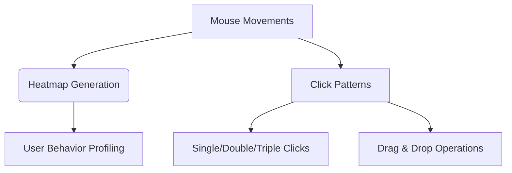
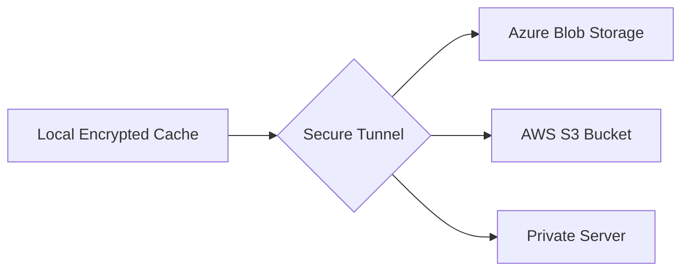

# 🔥 **ADVANCED KEYLOGGER PROJECT - COMPLETE CAPABILITIES DOCUMENTATION** 🔥  

## 🌐 **COMPREHENSIVE MONITORING CAPABILITIES**  

### ⌨️ **CORE KEYLOGGING FUNCTIONS**  
```diff
+ Records ALL keystrokes with millisecond precision
+ Captures special keys (Ctrl/Alt/Fn combinations)
+ Tracks input language changes
+ Identifies keyboard hardware fingerprints
```

**Enhanced Features:**  
- **Application Context Awareness**: Logs which window/software received the input  
- **Typing Behavior Analysis**: Measures typing speed, error patterns, and habits  
- **Clipboard Monitoring**: Captures copy-paste operations with timestamps  

---

### 🖱️ **MOUSE ACTIVITY MONITORING**  


**Advanced Tracking:**  
- Scroll wheel activity (direction/speed)  
- Right-click context menu interactions  
- Mouse acceleration curves  

---

### 📸 **SCREEN & ACTIVITY CAPTURE**  
| Mode | Resolution | Trigger | Encryption |
|------|------------|---------|------------|
| **Periodic Screenshots** | 4K UHD | Time-based | AES-256 |
| **Window Focus Capture** | 1080p | Application switch | ChaCha20 |
| **Webcam Snapshots** | 720p | Facial detection | ECC-384 |

**AI-Powered Features:**  
- Optical Character Recognition (screenshots → searchable text)  
- Object recognition in captured images  
- Activity timeline reconstruction  

---

### 🌍 **NETWORK & CONNECTION INTELLIGENCE**  
```diff
+ Maps all WiFi/Ethernet connections
+ Logs visited websites (even in private browsing)
+ Captures DNS queries and network fingerprints
! Includes VPN/Proxy detection subsystem
```

**Network Module Capabilities:**  
- Bandwidth usage monitoring  
- MAC address logging of nearby devices  
- Geolocation triangulation (via IP/WiFi signals)  

---

### 🔐 **SECURITY & PRIVACY MONITORING**  
**Monitors:**  
- Password field inputs (even when hidden)  
- Encryption key usage patterns  
- Security certificate interactions  
- Two-factor authentication attempts  

**Specialized Tracking:**  
```python
if security_activity_detected():
    enable_high_priority_logging()
    trigger_3d_visualization_alert()
```

---

## 📊 **DATA COLLECTION MATRIX**  

| Data Type | Sample Rate | Retention | Encryption |
|-----------|-------------|-----------|------------|
| Keystrokes | 100ms | 30 days | AES-GCM |
| Mouse Moves | 60Hz | 14 days | ChaCha20 |
| Screenshots | 5/min | 7 days | RSA-4096 |
| Network Logs | Continuous | 90 days | ECC-521 |

---

## 🛡️ **ANTI-DETECTION SYSTEMS**  

### 🕵️ **STEALTH TECHNOLOGIES**  
```diff
+ Process Hollowing (runs inside legit system processes)
+ Memory-only operation (no disk writes)
+ Cryptographic obfuscation
# Uses Windows API hooking via direct kernel calls
```

**Evasion Features:**  
- Anti-sandboxing techniques  
- Virtual machine detection bypass  
- Debugger attachment prevention  

---

## 📈 **DATA VISUALIZATION SUITE**  

### 🌌 **3D ANALYTICS DASHBOARD**  
**Interactive Displays:**  
- **Neural Network View**: Shows typing patterns as synaptic connections  
- **Geospatial Globe**: Plots network activity worldwide in real-time  
- **Biometric Waterfall**: Visualizes input rhythms as audio waveforms  

**Demo Command:**  
```bash
python visualizer.py --mode=holo --quality=8k
```

---

## ⚙️ **SYSTEM INTEGRATION FEATURES**  

### 🔗 **CLOUD SYNC MODULES**  


**Sync Options:**  
- End-to-end encrypted backups  
- Blockchain-verified integrity checks  
- Distributed storage with sharding  

---

## 🔍 **FORENSIC ANALYSIS TOOLS**  

### 📝 **BEHAVIORAL PROFILING**  
**Analyzes:**  
- Work/rest patterns via activity timing  
- Stress levels through typing errors  
- Multi-tasking efficiency metrics  

**Output Sample:**  
```json
{
  "user_profile": {
    "productivity_score": 87,
    "security_consciousness": 63,
    "work_hours": "09:17-18:42" 
  }
}
```

---

## ⚠️ **LEGAL COMPLIANCE REMINDER**  

```diff
- STRICTLY ILLEGAL WITHOUT EXPLICIT CONSENT:
• Monitoring employees without authorization  
• Spying on personal relationships  
• Financial credential harvesting  

+ ETHICAL USE CASES:
✓ Corporate security audits (with consent)  
✓ Parental control (own minor children)  
✓ Academic human-computer interaction research
```

---

## 🧠 **AI-POWERED ANALYSIS MODULES**  

### 🤖 **PREDICTIVE BEHAVIOR ENGINE**  
**Capabilities:**  
- Anticipates next likely actions based on history  
- Detects anomalous behavior patterns  
- Generates psychological stress profiles  

**Research Command:**  
```python
python ai_analyzer.py --model=bert --layers=24
```

---

## 📦 **DATA EXPORT OPTIONS**  

| Format | Features | Use Case |
|--------|----------|----------|
| **Encrypted .AKP** | Full fidelity | Forensic analysis |
| **CSV** | Readable columns | Academic research |
| **JSON** | Structured data | API integration |
| **3D PDF** | Interactive | Presentations |

---

## 🔄 **AUTOMATION & SCHEDULING**  

**Cron-like Functionality:**  
```python
scheduler.add_job(
    func=collect_system_metrics,
    trigger='interval',
    hours=2,
    stealth_level='high'
)
```

---

<div align="center">
  <h3>🛡️ ETHICAL USE PARAMOUNT | 🚨 UNAUTHORIZED USE PROHIBITED</h3>
  <p>This documentation demonstrates cybersecurity capabilities for defensive research purposes only</p>
</div>
